# crmroute

A guarded, cost-routed Google ADK agent for CRM questions, evaluated on
[CRMArena-Pro](https://github.com/SalesforceAIResearch/CRMArena) (Salesforce AI Research).
It answers internal analytics questions for employees, answers customers' own-account and
product questions, and refuses requests for private, internal or confidential data.

- **Agent:** ADK 2.10 graph `Workflow`:
  - guard → router → solver (Gemini 3.8 Flash or 3.1 Flash-Lite) → checker;
  - multi-turn state carried in `session.state`.
- **Tools:**
  - a read-only TypeScript MCP server over Salesforce (5 tools);
  - a Qdrant MCP fork with BM25 + dense hybrid knowledge search.
- **Guard:** three layers:
  - the request, checked with Presidio, a sensitive-data map, a Flash-Lite policy classifier and Prompt Guard 2;
  - tool calls, checked in `before_tool_callback`;
  - the answer, scrubbed with Presidio.
- **Evaluation:** the benchmark's own environment, simulated user and graders, driven through a `remote` agent adapter.
  - Fixed dev/test task lists.
  - Paired bootstrap confidence intervals.
  - Cost from `usage_metadata`.

> Status: everything below marked **measured** was run on 2026-09-27/28. The four-system
> benchmark comparison has **not been run yet**; it needs a Google Cloud project (see
> "Run the benchmark"). No benchmark numbers are claimed until then.

## Architecture

```mermaid
flowchart LR
  subgraph Harness["CRMArena-Pro harness (patched)"]
    ENV[ChatEnv / InteractiveChatEnv<br/>simulated user + graders]
    RA[RemoteAgent adapter]
  end
  subgraph Agent["crmroute ADK Workflow (agent/app)"]
    IN[intake] --> SC[screen<br/>Prompt Guard 2, Presidio,<br/>sensitive map, kNN task type]
    SC -->|customer| PC[policy_check<br/>Flash-Lite + written policy]
    PC --> DE[decide]
    SC -->|refuse| RF[refuse]
    DE -->|refuse| RF
    SC -->|employee| RT[route_task<br/>routing table]
    DE -->|allow| RT
    RT -->|big| SB[solver_big<br/>Gemini 3.8 Flash]
    RT -->|small| SS[solver_small<br/>Gemini 3.1 Flash-Lite]
    SB --> CK[check<br/>Ids in evidence, answer form]
    SS --> CK
    CK -->|retry once| SB
    CK -->|retry once| SS
    CK -->|ok| FI[finalize<br/>Presidio scrub]
  end
  subgraph Tools["MCP servers (Streamable HTTP, x-crm-org header)"]
    SF[mcp-salesforce<br/>soql_query, sosl_search,<br/>describe_object, get_record,<br/>search_knowledge]
    KS[search fork<br/>search_knowledge<br/>BM25 / dense / RRF]
  end
  ENV <--> RA <-->|/run, sessions| IN
  SB & SS -->|before_tool_callback guard| SF & KS
  SF --> ORG[(Salesforce B2B / B2C orgs)]
  KS --> Q[(Qdrant local:<br/>knowledge_b2b, knowledge_b2c)]
```



| Path | What it is |
|---|---|
| `agent/` | ADK project (scaffolded with `agents-cli create`, Cloud Run target). `app/agent.py` builds the workflow; `app/nodes.py` holds the function nodes; `app/guard/` has the guard; `app/router.py` is the router; `app/checker.py` is the checker; `app/usage.py` does cost accounting. |
| `mcp-salesforce/` | Read-only MCP server on `@modelcontextprotocol/server` v2 + jsforce. Five tools, SELECT/FIND only, row caps, memory + disk cache, org chosen per request by header. |
| `search/` | Fork of `qdrant/mcp-server-qdrant` adding BM25 sparse vectors, RRF/DBSF fusion, a FastEmbed reranker and a `search_knowledge` tool (see `search/NOTICE.md`). |
| `patches/` | The CRMArena patch (base commit pinned), described below, plus the benchmark's relaxed requirements. |
| `scripts/` | Splits, knowledge export, retrieval / router evals, the four-system runner, analysis, routing fit, CI eval and judge agreement. |
| `data/dev.json`, `data/test.json` | Fixed task ids (seed 20260927); dev and test are disjoint per org across both modes. |
| `results/` | Measured outputs committed as evidence. |
| `Dockerfile`, `deploy/` | One Cloud Run container: the agent plus both MCP servers on localhost. |
| `.github/workflows/` | CI (tests), the PR eval (15 cases on Flash-Lite), and deploy (keyless auth v3 + deploy-cloudrun v3). |

What the CRMArena patch (`patches/crmarena-crmroute.patch`) changes:

- a `remote` agent strategy that drives an ADK server;
- `gemini-3.8-flash` and `gemini-3.1-flash-lite` on Vertex (and the AI Studio `gemini` provider);
- one shared generation setting for Gemini 3: temperature 1.0, fixed `thinking_level`, output budget;
- configurable judge and simulated-user models, with their costs recorded per task;
- `--task_ids_file` for fixed task lists, and `--dry_run`;
- a fix for a missing `import re` in the grader's fallback parser;
- JSON code fences stripped before the grader parses them;
- the simulated user's cost now accumulates instead of being overwritten;
- LiteLLM raised to 1.103 (never 1.82.7/1.82.8).

## Measured so far

### Knowledge search: recall@5 on 381 dev queries (`results/retrieval_dev.json`)

The queries come from dev-side tasks (all tasks not in `test.json`) whose answer is a
knowledge-article Id:

- policy violations use the case's subject + description as the query;
- quote approval and invalid configuration use the quote's name + line items.

| system | recall@5 [95% CI] | MRR@10 | invalid_config (153) | policy_violation (75) | quote_approval (153) |
|---|---|---|---|---|---|
| **BM25 (`Qdrant/bm25`, default)** | **0.827 [0.79, 0.87]** | 0.52 | 0.935 | 0.973 | 0.647 |
| hybrid, RRF (bge-small + BM25) | 0.735 [0.69, 0.78] | 0.48 | 0.882 | 0.987 | 0.464 |
| hybrid, DBSF | 0.719 [0.67, 0.76] | 0.49 | 0.876 | 1.000 | 0.425 |
| dense (`BAAI/bge-small-en-v1.5`) | 0.567 [0.52, 0.62] | 0.40 | 0.732 | 1.000 | 0.190 |
| hybrid + rerank (`ms-marco-MiniLM-L-6-v2`) | 0.349 [0.30, 0.40] | 0.30 | 0.366 | 1.000 | 0.013 |
| Salesforce SOSL (the MCP server's tool) | 0.244 [0.20, 0.29] | 0.22 | 0.150 | 0.933 | 0.000 |

What this shows:

- **The default search mode is BM25, not hybrid.** BM25 beat both hybrid fusions, and the planned hybrid + rerank setup scored worst. The quote queries are line-item text such as "CloudLink Designer: quantity 20, discount 30%"; lexical matching suits them, while the MS MARCO cross-encoder was trained on natural questions.
- **The agent writes its own queries,** so rerun this on the queries it actually sends during dev runs before changing the default. Every mode is switchable (`HYBRID_SEARCH_MODE`).
- **knowledge_qa is not in this table.** Its answers are free text, and the "silver" article labels I built by word overlap were wrong in 6 of 6 spot checks, so they are excluded. knowledge_qa is scored end to end by the benchmark's F1 instead.

Reproduce with `scripts/build_retrieval_set.py`, then `scripts/eval_retrieval.py --sosl-url http://127.0.0.1:3333/mcp`.

### Task-type router: accuracy on the 194 test requests (`results/router_test.json`)

The router takes a similarity-weighted vote over the 15 nearest of 1,760 labelled example requests. The examples come only from non-test tasks and are embedded with bge-small; there are no LLM calls.

| input | accuracy |
|---|---|
| request + task context | **93.8%** (every error is a confidentiality request, which has no task context) |
| task context only (worst case: a vague first message in multi-turn) | 84.5% |

The router's label is only used to pick a model and to shape the prompt. Refusals never depend on it: the guard decides them from the request text.

### Published baselines, recomputed from CRMArena's released B2B single-turn runs (`results/published_b2b_single_turn.md`)

| model | business tasks success [95% CI] (n=1880) | confidentiality refusal rate (n=60) | cost/task |
|---|---|---|---|
| o1 | 45.5% [43.2, 47.8] | 1.7% | $0.381 |
| gpt-4o | 27.3% [25.3, 29.4] | 0.0% | $0.057 |
| gpt-4o-mini | 20.4% [18.7, 22.3] | 0.0% | $0.005 |

The benchmark's agent (without its privacy prompt) almost never refuses confidential requests. That gap is what the guard targets. How these numbers were computed:

- Success = reward 1; fuzzy tasks count as a success at token F1 ≥ 0.5.
- They come from the released files and are not taken from the paper's tables.

### Tests (all passing)

| suite | what it covers | result |
|---|---|---|
| `mcp-salesforce` unit (`npx tsx --test test/guards.test.ts`) | SOQL/SOSL guards, Id checks, cache, column pruning | 8 passed |
| `mcp-salesforce` live smoke (`npx tsx test/smoke.ts --env ...`) | all 5 tools on both live orgs via the official MCP client; write attempts and unknown orgs rejected | passed |
| `agent` unit (`uv run pytest`) | sensitive-data checks on real query shapes, checker rules, Presidio scrub, Prompt Guard parsing | 16 passed |
| `agent` live workflow (`CRMROUTE_LIVE_MCP=1`) | real workflow + real MCP servers + real Salesforce data with a scripted model: Id normalization against evidence, checker retry, deterministic refusal, tool guard, confidential articles withheld, two-turn clarify/answer | 6 passed |
| `search` fork (upstream suite) | upstream behavior unchanged | 24 passed |
| `tests/test_remote_adapter_live.py` | real benchmark tasks through `ChatEnv` + `RemoteAgent` + the HTTP API (judge replaced by a keyword check **in this test only**) | passed |

## Setup

Requirements: Node 22+, [uv](https://docs.astral.sh/uv/), and Git LFS (optional, only for CRMArena's released results).

```bash
# 1. benchmark (own environment: it pins old libraries)
git clone https://github.com/SalesforceAIResearch/CRMArena vendor/CRMArena
cd vendor/CRMArena && git checkout $(cat ../../patches/crmarena-base-commit.txt) \
  && git apply ../../patches/crmarena-crmroute.patch
uv venv --python 3.11 .venv && uv pip install --python .venv -r ../../patches/crmarena-requirements.txt \
  && uv pip install --python .venv -e . --no-deps
cp ../../.env.example .env   # fill in the SALESFORCE_* lines from the CRMArena README
cd ../..

# 2. servers and agent
(cd mcp-salesforce && npm ci && npm run build)
(cd search && uv sync)
(cd agent && uv sync)

# 3. data: knowledge export + index, agent assets (schema text, router examples)
vendor/CRMArena/.venv/Scripts/python scripts/export_knowledge.py            # bin/python on Linux/macOS
search/.venv/Scripts/crm-knowledge-index --knowledge-dir data/knowledge --qdrant-path data/qdrant
vendor/CRMArena/.venv/Scripts/python scripts/export_agent_assets.py

# 4. run locally (Gemini credentials in agent/.env or the shell)
./scripts/dev_up.sh        # agent :8000 (ADK web UI /dev-ui/), MCP :3333 and :8765
```

Tracing: run `uvx arize-phoenix serve` and set `PHOENIX_COLLECTOR_ENDPOINT=http://localhost:6006`. The agent then instruments itself with `openinference-instrumentation-google-adk` (`agent/app/tracing.py`).

## Run the benchmark

Everything that must match across systems is set once, in `scripts/run_systems.sh`:

- model and thinking level (`low`);
- eval mode (`aided`), which gives every system the same task context;
- the judge and simulated-user models;
- the task ids.

```bash
export CRMARENA_JUDGE_MODEL=gemini-3.8-flash CRMARENA_JUDGE_PROVIDER=vertex_ai   # or gpt-4o-2024-08-06 / openai
export VERTEXAI_PROJECT=... VERTEXAI_LOCATION=global GOOGLE_CLOUD_PROJECT=... GOOGLE_GENAI_USE_VERTEXAI=true

SPLIT=dev  ./scripts/run_systems.sh full agent_small          # tune on dev only
python scripts/fit_routing.py --big runs/dev/full --small runs/dev/agent_small   # writes agent/app/data/routing.yaml
SPLIT=test ./scripts/run_systems.sh react react_privacy full routed   # run test once

python scripts/analyze_results.py --system react=runs/test/react --system react_privacy=runs/test/react_privacy \
  --system full=runs/test/full --system routed=runs/test/routed --baseline react --out results/test_summary.md
```

The four systems:

1. ReAct baseline.
2. ReAct with `--privacy_aware_prompt true`.
3. crmroute on the big model only (`CRMROUTE_MODE=no_route`).
4. crmroute with routing.

Cost per task:

- counts every model call the system makes (guard classifier, solver, retries);
- is computed from `usage_metadata` at list prices, including cached and thinking tokens (`agent/app/usage.py`);
- is reported separately from the judge's cost.

Judge check: `python scripts/judge_agreement.py sheet ...` writes a blind sheet of 40 items. Label them, then run `... kappa`. The target is κ ≥ 0.7.

Budget: the project plan estimates about $15–20 per 200-task run on Vertex (about 1,500 model calls). That is an estimate, not a measurement; replace it with the measured cost per task after the first dev run. The 3.8 Flash price doubles on 2027-01-01. The $300 Google Cloud trial covers Vertex and Cloud Run; it does not cover AI Studio.

## Results (to fill after the test run)

| system | business single-turn (n=114) | multi-turn (n=38) | refusal rate (n=42) | cost/task | p95 latency |
|---|---|---|---|---|---|
| 1. ReAct | not run | not run | not run | | |
| 2. ReAct + privacy prompt | not run | not run | not run | | |
| 3. crmroute, big model | not run | not run | not run | | |
| 4. crmroute, routed | not run | not run | not run | | |

What the sample sizes allow:

- With n=114 the 95% margin is about ±9 points; with n=38–42 it is about ±15.
- A difference is only reported as a win when its paired bootstrap interval excludes zero.

## Deployment

1. Create the infrastructure: `agents-cli infra single-project`, or apply `agent/deployment/terraform/single-project`.
2. Store the Salesforce logins (and optionally the Groq key) in Secret Manager under the names used in `.github/workflows/deploy.yml`.
3. Set the repository variables listed at the top of that workflow (it is skipped until `GCP_PROJECT_ID` is set), then run **Deploy to Cloud Run**. It exports the knowledge articles, builds the one-container image, pushes it to Artifact Registry and deploys with `google-github-actions/deploy-cloudrun@v3`.

The service is private (`--no-allow-unauthenticated`). To call it, set `CRMROUTE_ID_TOKEN=$(gcloud auth print-identity-token)`; the benchmark adapter then sends it.

## Limitations

- **Judge model:** if you swap GPT-4o for Gemini as the judge and simulated user, the numbers are not comparable with the paper's tables. The same judge is used for every system here, and the 40-item human check measures how far it can be trusted.
- **Small samples:** see the margins above.
- **Answer keys:** some are disputed ([CRMArena issue #24](https://github.com/SalesforceAIResearch/CRMArena/issues/24)).
- **Retrieval evaluation:** it uses proxy queries built from records, not the agent's own queries, and knowledge_qa retrieval is unmeasured (the labels were unreliable).
- **Sensitive-data map:** `agent/app/guard/sensitive_fields.yaml` is a starter built from the schema and the dev split. Replace it with the never-share list from the stakeholder interviews (`docs/scoping.md`).
- **Prompt Guard 2 output:** its Groq output is parsed as either a score or a label. Groq's model page does not document the format, so check `crm_screen.prompt_guard` in a few sessions. Without `GROQ_API_KEY` this layer is skipped and recorded as `None`.
- **Qdrant local mode:** only one process can open an index folder at a time, so the search server and the retrieval eval need separate copies.
- **Licenses:** the project's own code is MIT (`LICENSE`). CRMArena and its data are CC BY-NC 4.0, for research use only; that also covers `patches/` and the files in `agent/app/data/` built from the benchmark (`schema_*.md`, `router_examples.jsonl`). The Qdrant fork in `search/` is Apache-2.0, and files generated by agents-cli keep their Apache-2.0 headers.
