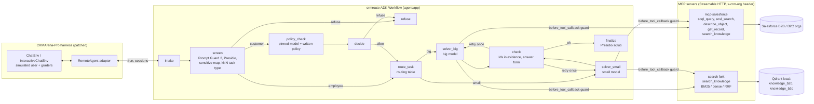

# crmroute

A guarded, cost-routed Google ADK agent for CRM questions, evaluated on
[CRMArena-Pro](https://github.com/SalesforceAIResearch/CRMArena) (Salesforce AI Research).
It answers internal analytics questions for employees, answers customers' own-account and
product questions, and refuses requests for private, internal or confidential data.

- **Agent:** ADK 2.10 graph `Workflow`:
  - guard → router → solver → checker, with one pinned model per role (any Gemini model through the AI Studio key, or any LiteLLM `provider/model`: Mistral, Groq, OpenRouter, local Ollama);
  - multi-turn state carried in `session.state`;
  - automatic provider fallback for local use (Gemini → Mistral → Groq → OpenRouter → Ollama), off in measured runs.
- **Tools:**
  - a read-only TypeScript MCP server over Salesforce (5 tools);
  - a Qdrant MCP fork with BM25 + dense hybrid knowledge search.
- **Guard:** three layers:
  - the request, checked with Presidio, a sensitive-data map, a policy classifier following a written policy, and Prompt Guard 2;
  - tool calls, checked in `before_tool_callback`;
  - the answer, scrubbed with Presidio.
- **Evaluation:** the benchmark's own environment, simulated user and graders, driven through a `remote` agent adapter.
  - Fixed dev/test task lists.
  - Paired bootstrap confidence intervals.
  - Tokens and calls from `usage_metadata`, with the model that answered every call logged.
- **Runs entirely on free API tiers and a local GPU** (no Google Cloud project).

> Status: everything in "Measured so far" was run on 2026-09-27 to 2026-09-30 with the
> commands shown. Free-tier quotas limit the benchmark comparison to a 50-task test subset
> (see "Results"), so its confidence intervals are wide.

## Architecture



| Path | What it is |
|---|---|
| `agent/` | ADK project (scaffolded with `agents-cli create`). `app/agent.py` builds the workflow; `app/nodes.py` holds the function nodes; `app/models.py` builds each role's model (pinned retry or demo fallback); `app/guard/` has the guard; `app/router.py` is the router; `app/checker.py` is the checker; `app/usage.py` logs every call. |
| `mcp-salesforce/` | Read-only MCP server on `@modelcontextprotocol/server` v2 + jsforce. Five tools, SELECT/FIND only, row caps, memory + disk cache, org chosen per request by header. |
| `search/` | Fork of `qdrant/mcp-server-qdrant` adding BM25 sparse vectors, RRF/DBSF fusion, a FastEmbed reranker and a `search_knowledge` tool (see `search/NOTICE.md`). |
| `patches/` | The CRMArena patch (base commit pinned), described below, plus the benchmark's relaxed requirements. |
| `scripts/` | Splits, knowledge export, retrieval / router evals, the four-system runner, analysis, routing fit, CI eval and judge agreement. |
| `data/dev.json`, `data/test.json` | Fixed task ids (seed 20260927); dev and test are disjoint per org across both modes. |
| `results/` | Measured outputs committed as evidence. |
| `Dockerfile`, `deploy/` | One container: the agent plus both MCP servers on localhost. Measured runs use it. |
| `.github/workflows/` | CI (tests) and the PR eval (15 cases on Gemini Flash-Lite, free keys from repository secrets). |

What the CRMArena patch (`patches/crmarena-crmroute.patch`) changes:

- a `remote` agent strategy that drives an ADK server;
- `gemini/...` (AI Studio key) and `mistral`, `groq`, `openrouter`, `ollama_chat` providers; the Gemini 3 models get one shared setting (temperature 1.0, fixed `thinking_level`, output budget) and Ollama the agent's context window and thinking-off setting;
- configurable judge and simulated-user models (temperature 0 for a non-Gemini judge);
- one rate-limit-aware completion wrapper for the agent, judge and simulated user: it waits and retries the same model on 429/503, stops the run on a used-up daily quota, and logs the model that answered every call into each result;
- a request larger than the provider's per-minute input quota (Gemini free tier: 250K tokens) is not retried: the task counts as the system's failure (reward 0, as upstream scores exceptions);
- resumable runs: tasks that end in an API error are redone on `--reuse_results`, and the run stops after 3 errors in a row;
- `--task_ids_file` for fixed task lists, and `--dry_run`;
- fixes for three upstream bugs: a missing `import re` in the grader's fallback parser, a crash on SOSL results that mix object types, and the simulated user's cost being overwritten instead of summed;
- JSON code fences stripped before the grader parses them;
- LiteLLM raised to 1.103 (never 1.82.7/1.82.8).

## Measured so far

### Knowledge search: recall@5 on 381 dev queries (`results/retrieval_dev.json`)

The queries come from dev-side tasks (all tasks not in `test.json`) whose answer is a
knowledge-article Id:

- policy violations use the case's subject + description as the query;
- quote approval and invalid configuration use the quote's name + line items.

| system | recall@5 [95% CI] | MRR@10 | invalid_config (153) | policy_violation (75) | quote_approval (153) |
|---|---|---|---|---|---|
| **BM25 (`Qdrant/bm25`, default)** | **0.827 [0.79, 0.87]** | 0.52 | 0.935 | 0.973 | 0.647 |
| hybrid, RRF (bge-small + BM25) | 0.735 [0.69, 0.78] | 0.48 | 0.882 | 0.987 | 0.464 |
| hybrid, DBSF | 0.719 [0.67, 0.76] | 0.49 | 0.876 | 1.000 | 0.425 |
| dense (`BAAI/bge-small-en-v1.5`) | 0.567 [0.52, 0.62] | 0.40 | 0.732 | 1.000 | 0.190 |
| hybrid + rerank (`ms-marco-MiniLM-L-6-v2`) | 0.349 [0.30, 0.40] | 0.30 | 0.366 | 1.000 | 0.013 |
| Salesforce SOSL (the MCP server's tool) | 0.244 [0.20, 0.29] | 0.22 | 0.150 | 0.933 | 0.000 |

What this shows:

- **The default search mode is BM25, not hybrid.** BM25 beat both hybrid fusions, and the planned hybrid + rerank setup scored worst. The quote queries are line-item text such as "CloudLink Designer: quantity 20, discount 30%"; lexical matching suits them, while the MS MARCO cross-encoder was trained on natural questions.
- **The agent writes its own queries,** so rerun this on the queries it actually sends during dev runs before changing the default. Every mode is switchable (`HYBRID_SEARCH_MODE`).
- **knowledge_qa is not in this table.** Its answers are free text, and the "silver" article labels I built by word overlap were wrong in 6 of 6 spot checks, so they are excluded. knowledge_qa is scored end to end by the benchmark's F1 instead.

Reproduce with `scripts/build_retrieval_set.py`, then `scripts/eval_retrieval.py --sosl-url http://127.0.0.1:3333/mcp`.

### Task-type router: accuracy on the 194 test requests (`results/router_test.json`)

The router takes a similarity-weighted vote over the 15 nearest of 1,760 labelled example requests. The examples come only from non-test tasks and are embedded with bge-small; there are no LLM calls.

| input | accuracy |
|---|---|
| request + task context | **93.8%** (every error is a confidentiality request, which has no task context) |
| task context only (worst case: a vague first message in multi-turn) | 84.5% |

The router's label is only used to pick a model and to shape the prompt. Refusals never depend on it: the guard decides them from the request text.

### Published baselines, recomputed from CRMArena's released B2B single-turn runs (`results/published_b2b_single_turn.md`)

| model | business tasks success [95% CI] (n=1880) | confidentiality refusal rate (n=60) | cost/task |
|---|---|---|---|
| o1 | 45.5% [43.2, 47.8] | 1.7% | $0.381 |
| gpt-4o | 27.3% [25.3, 29.4] | 0.0% | $0.057 |
| gpt-4o-mini | 20.4% [18.7, 22.3] | 0.0% | $0.005 |

The benchmark's agent (without its privacy prompt) almost never refuses confidential requests. That gap is what the guard targets. How these numbers were computed:

- Success = reward 1; fuzzy tasks count as a success at token F1 ≥ 0.5.
- They come from the released files and are not taken from the paper's tables.

### Provider smoke test (2026-09-29, `results/provider_smoke_2026-09-29.jsonl`, `results/provider_probe_2026-09-29.json`)

Three dev tasks per provider through the real agent (every role on that one model, live Salesforce data): a B2B analytics task, a B2B policy-violation task and a customer request about another customer.

| model | analytics | policy violation | refusal | note |
|---|---|---|---|---|
| `gemini-3.1-flash-lite` (AI Studio) | pass | wrong answer | pass | 12 calls / 120K tokens on the hard task |
| `groq/openai/gpt-oss-120b` | pass | failed | pass | one request needed 11.7K tokens; Groq's free limit is 8K tokens/minute |
| `openrouter/nvidia/nemotron-3-super-120b-a12b:free` | pass | not run | pass | `qwen/qwen3.8-27b:free` was throttled upstream all day |
| `ollama_chat/qwen3:8b` (local) | wrong answer | timed out | pass | about 8 s per call on an RTX 5070 |
| `mistral/mistral-small-latest` | failed | failed | failed | the key has no quota (429, limit 0/minute) |

Integration bugs these runs found and fixed: Groq rejects a JSON response format next to tools and replayed `reasoning_content`; small models write tool calls as text; a 200-row SOQL result (60K tokens) blew up the context (fixed with a 16K-character response budget and a 10-call tool budget per turn); the policy classifier's reply leaked into the solver's conversation (it is now a direct call, not an agent node).

### Tests (all passing)

| suite | what it covers | result |
|---|---|---|
| `mcp-salesforce` unit (`npx tsx --test test/guards.test.ts`) | SOQL/SOSL guards, Id checks, cache, column pruning, response-size budget | 9 passed |
| `mcp-salesforce` live smoke (`npx tsx test/smoke.ts --env ...`) | all 5 tools on both live orgs via the official MCP client; write attempts and unknown orgs rejected | passed |
| `agent` unit (`uv run pytest`) | sensitive-data checks on real query shapes, checker rules, PII scrub (Presidio and pattern fallback), Prompt Guard parsing, pinned retry vs. fallback on real provider error texts, tool-call repair, policy-verdict parsing | 29 passed |
| `tests/test_bench_retry.py` (benchmark env) | the harness waits and retries the same model on 429/503, stops on a daily quota, never retries an oversized request | 3 passed |
| `agent` live workflow (`CRMROUTE_LIVE_MCP=1`) | real workflow + real MCP servers + real Salesforce data with a scripted model: Id normalization against evidence, checker retry, deterministic refusal, tool guard, confidential articles withheld, two-turn clarify/answer, routing to the small solver, policy verdict kept out of the solver's conversation | 7 passed |
| `search` fork (upstream suite) | upstream behavior unchanged | 24 passed |
| `tests/test_remote_adapter_live.py` | real benchmark tasks through `ChatEnv` + `RemoteAgent` + the HTTP API (judge replaced by a keyword check **in this test only**) | passed |

## Setup

Requirements: Node 22+, [uv](https://docs.astral.sh/uv/), Docker, [Ollama](https://ollama.com) with `qwen3:8b`, and free API keys (Gemini AI Studio, Groq; optionally Mistral and OpenRouter). Git LFS is optional (only for CRMArena's released results).

```bash
# 0. keys: copy .env.example to .env at the repo root and fill it in (never commit it)

# 1. benchmark (own environment: it pins old libraries)
git clone https://github.com/SalesforceAIResearch/CRMArena vendor/CRMArena
cd vendor/CRMArena && git checkout $(cat ../../patches/crmarena-base-commit.txt) \
  && git apply ../../patches/crmarena-crmroute.patch
uv venv --python 3.11 .venv && uv pip install --python .venv -r ../../patches/crmarena-requirements.txt \
  && uv pip install --python .venv -e . --no-deps
cp ../../.env.example .env   # keep only the SALESFORCE_* lines, filled from the CRMArena README
cd ../..

# 2. servers and agent
(cd mcp-salesforce && npm ci && npm run build)
(cd search && uv sync)
(cd agent && uv sync)

# 3. data: knowledge export + index, agent assets (schema text, router examples)
vendor/CRMArena/.venv/Scripts/python scripts/export_knowledge.py            # bin/python on Linux/macOS
search/.venv/Scripts/crm-knowledge-index --knowledge-dir data/knowledge --qdrant-path data/qdrant
vendor/CRMArena/.venv/Scripts/python scripts/export_agent_assets.py

# 4. local demo: agent :8000 (ADK web UI /dev-ui/), MCP :3333 and :8765, fallback on
./scripts/dev_up.sh
```

Every model call is appended to `runs/dev_logs/calls.jsonl` with the model that answered it and, in fallback mode, the providers that failed first and why.

**Docker.** `docker build -t crmroute:local .` builds one image with the agent and both MCP servers (the knowledge index is built into it). Run it with the keys and Salesforce logins as env files; the agent reaches Ollama on the host:

```bash
docker run --rm -p 8080:8080 --env-file .env --env-file vendor/CRMArena/.env \
  -e OLLAMA_API_BASE=http://host.docker.internal:11434 -e CRMROUTE_FALLBACK=1 crmroute:local
```

Windows note: with Smart App Control on, Windows blocks spaCy's compiled parser, so on the host the guard falls back to pattern-only PII detection (contact details and ids, no person names) and records `pii_engine=patterns_only`. Measured runs therefore run the agent in the Docker image, where Presidio loads fully.

Tracing: run `uvx arize-phoenix serve` and set `PHOENIX_COLLECTOR_ENDPOINT=http://localhost:6006`. The agent then instruments itself with `openinference-instrumentation-google-adk` (`agent/app/tracing.py`).

## Run the benchmark

Everything that must match across systems is set once, in `scripts/run_systems.sh`:

- one pinned model per role (`BIG_MODEL`, `SMALL_MODEL`, `POLICY_MODEL`), never switched during a run: rate limits and overloads are waited out, and a used-up daily quota stops the run so it can resume after the reset;
- thinking level (`low`) and eval mode (`aided`, which gives every system the same task context);
- the judge and simulated-user models;
- the task ids.

Each system writes `manifest_<system>.json` (every pin, the image id and commit) and two call logs (`agent_calls_*.jsonl`, `bench_calls_*.jsonl`). Before a big run, check it fits the free tiers:

```bash
python scripts/estimate_budget.py --split data/test_small.json --systems react react_privacy full routed \
  --big gemini-3.1-flash-lite --small ollama_chat/qwen3:8b --policy groq/openai/gpt-oss-20b \
  --judge ollama_chat/qwen3:8b --user ollama_chat/qwen3:8b --days 2
```

The measured runs used these pins:

```bash
export BIG_MODEL=gemini-3.1-flash-lite SMALL_MODEL=ollama_chat/qwen3:8b POLICY_MODEL=groq/openai/gpt-oss-20b \
       CRMARENA_JUDGE_MODEL=ollama_chat/qwen3:8b CRMARENA_JUDGE_PROVIDER=ollama_chat MODES=single

TASK_IDS=data/dev_small.json OUT=runs/dev_small ./scripts/run_systems.sh full agent_small   # tune on dev only
python scripts/fit_routing.py --big runs/dev_small/full --small runs/dev_small/agent_small --min-n 2 --margin 0
TASK_IDS=data/test_small.json OUT=runs/test_small ./scripts/run_systems.sh react react_privacy full routed

python scripts/analyze_results.py --system react=runs/test_small/react --system react_privacy=runs/test_small/react_privacy \
  --system full=runs/test_small/full --system routed=runs/test_small/routed --baseline react --out results/test_small_summary.md
```

The four systems:

1. ReAct baseline (the benchmark's agent, on `BIG_MODEL`).
2. ReAct with `--privacy_aware_prompt true`.
3. crmroute on the big model only (`CRMROUTE_MODE=no_route`).
4. crmroute with routing (small model where the dev fit allows).

Judge check: `python scripts/judge_agreement.py sheet ...` writes a blind sheet of 40 items. Label them, then run `... kappa`. The target is κ ≥ 0.7.

## Results

All runs: free tiers only, one pinned model per role, judge = local `ollama_chat/qwen3:8b` for every system, eval mode `aided`, single-turn tasks. Every task's calls (with the model that answered) are in `runs/`, and each system's pins are in `runs/*/manifest_*.json`.

### Dev (`data/dev_small.json`, 44 tasks; used to fit routing, not a reported result) — `results/dev_small_summary.md`

| system | business tasks (n=38) success [95% CI] | refusals (n=6) | model calls/task | tokens/task |
|---|---|---|---|---|
| crmroute, Gemini 3.1 Flash-Lite | 63.2% [47.4, 78.9] | 6/6 | 5.1 | 50K |
| crmroute, local qwen3:8b for everything | 7.9% [0.0, 18.4] | 6/6 | 9.7 | 76K |

The local 8B model is 55 points worse on business tasks (paired 95% CI −71 to −37). Refusals do not depend on the solver: the policy classifier (Groq gpt-oss-20b) decides them. The routing fit (`agent/app/data/routing.yaml`, `--min-n 2 --margin 0`) keeps 15 of 19 task types on Flash-Lite and sends 4 to the local model — knowledge_qa, sales_insight_mining (both 0/2 on dev for both models), lead_qualification and top_issue_identification (1/2 each).

### Test (`data/test_small.json`, 50 tasks)

**In progress.** The Gemini free tier allows 500 Flash-Lite requests per day (the quota error states `limit: 500`, `GenerateRequestsPerDayPerProjectPerModel-FreeTier`), and the four systems need about 1,000. The run stops cleanly when the quota is used up and resumes after the reset (midnight Pacific). This table will be filled from `scripts/analyze_results.py` once all four systems have all 50 tasks.

| system | business (n=38) | refusals (n=12) | Flash-Lite calls/task |
|---|---|---|---|
| 1. ReAct baseline (Flash-Lite) | running | running | |
| 2. ReAct + privacy prompt | running | running | |
| 3. crmroute, Flash-Lite only | running | running | |
| 4. crmroute, routed | running | running | |

What the sample sizes allow: with n=38 the 95% margin is about ±16 points, and with n=12 about ±28. A difference is only reported as a win when its paired bootstrap interval excludes zero.

## Deployment

Local only: `./scripts/dev_up.sh` or the Docker image above. The earlier Cloud Run workflow was removed because the project runs on free API keys without a Google Cloud project; `agent/deployment/terraform/` is the unused agents-cli scaffold.

## Limitations

- **Free-tier models, not the planned ones.** Gemini 3.8 Flash's free tier (about 20 requests/day, and 503 "high demand" errors on 2026-09-29) cannot carry a benchmark run, and the Mistral key had no quota (429 with a limit of 0 per minute). The measured runs therefore pin Gemini 3.1 Flash-Lite as the big model and local qwen3:8b as the small one.
- **Small test set.** Quotas allowed a 50-task single-task subset of `test.json` (`data/test_small.json`: 1 task per business type per org, 2 per confidentiality type per org). With n=38 business tasks the 95% margin is about ±16 points, and with n=12 refusal cases about ±28, so only large differences are claimed. Multi-turn tasks were not in the measured runs.
- **Routing fit.** `dev_small` has 2 tasks per task type, so the routing table (`--min-n 2 --margin 0`) sends a type to the small model only if the small model matched the big one on those 2 dev tasks. It is noisy by construction.
- **Judge model.** The judge is local qwen3:8b for every system, not the paper's GPT-4o, so numbers are not comparable with the paper's tables. The 40-item human check (`scripts/judge_agreement.py`) measures how far it can be trusted.
- **Policy classifier.** Groq's gpt-oss-20b is not fully repeatable even at temperature 0: one dev competitor question was refused on one run and allowed on the next. The tool guard withholds confidential articles regardless.
- **Answer keys:** some are disputed ([CRMArena issue #24](https://github.com/SalesforceAIResearch/CRMArena/issues/24)).
- **Retrieval evaluation:** it uses proxy queries built from records, not the agent's own queries, and knowledge_qa retrieval is unmeasured (the labels were unreliable).
- **Sensitive-data map:** `agent/app/guard/sensitive_fields.yaml` is a starter built from the schema and the dev split. Replace it with the never-share list from the stakeholder interviews (`docs/scoping.md`).
- **Prompt Guard 2 output:** on Groq it returns the injection probability as a bare number (checked live: 0.00043 for a benign request, 0.9994 for an injection). Without `GROQ_API_KEY` this layer is skipped and recorded as `None`.
- **Qdrant local mode:** only one process can open an index folder at a time, so the search server and the retrieval eval need separate copies.
- **Licenses:** the project's own code is MIT (`LICENSE`). CRMArena and its data are CC BY-NC 4.0, for research use only; that also covers `patches/` and the files in `agent/app/data/` built from the benchmark (`schema_*.md`, `router_examples.jsonl`). The Qdrant fork in `search/` is Apache-2.0, and files generated by agents-cli keep their Apache-2.0 headers.
